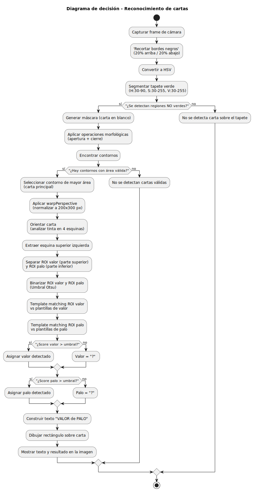

# Documentación 
---
# 1. Hardware
 - Cámara utilizada: Iphone 15, IVCam para conectarlo 
 - FPS: 30 fps
 - Fondo: tapete verde uniforme 

 ## Requisitos 
 - Descarga de IVCam en el smartphone y ordenador 
 - Conexión WI-Fi estable 
 - Espacio sin sombras 

 ## Justificación 
 - El uso de IVCam permite obtener una imagen de alta calidad sin necesidad de una webcam 
 - El fondo verde facilita la segmentación mediante HSV, reduciendo falsos positivos
 ---
 # 2. Software
 - Lenguaje: Python 3.13.9
 - Librerías: OpenCV, NumPy, os 

## Requisitos
- Python instalado
- Pip + módulos
- Permisos para acceder a la cámara 

## Justificación 
- OpenCv es es estándar en visión artificial por su velocidad y funciones integradas. Permite: 
    - Segmentar el tapete verde
    - Detectar contornos de cartas 
    - Normalizar perspectiva
    - Umbralizar y extraer número/palo
    - Comparar plantillas 
---
# 3. Hoja de ruta del desarrollo 
## Paso 1:
- Recorte de las bandas negras 
- Conversión a HSV
- Detección del color verde 
- Limpieza morfológica para eliminar ruido 

## Paso 2:
- Buscar contornos blancos (no-verde) 
- Filtrar por área para ignorar objetos pequeños o demasiado grandes 
- Normalizar carta mediante perspectiva 

## Paso 3: 
- Orientar la carta automáticamente según qué esquina tiene más "tinta"
- Recortar un ROI de la esquina superior izquierda 

## Paso 4: 
- Captura automática del número y palo
- Guardado en directorios: plantillas/valor o ./palo

## Paso 5: 
- Resize el tamaño de la plantilla correspondiente
- Aplicación de matchTemplate
- Selección del mayor score (> 0.30)
---
# 4. Solución 

---
# Secuencialización 
## Recorte de bordes 
- Para eliminar sombras o bordes introducidos por IVCam

## Segmentación HSV
- Se elige HSV porque separa mejor el color, incluso con variación de luz 
    - H: tono → detecta verde
    - S: saturación → evita identificar zonas grisáceas
    - V: brillo 

## Morfología
- OPEN elimina el ruido de puntos blancos 
- CLOSE elimina huecos dentro de las cartas 

## Contornos 
- Los contornos detectan als cartas como regiones blancas no-verdes 

## Orientación automática 
- Se detecta qué esquina tiene más píxeles blancos después del umbralizado

## Threshold OTSU
- Hace la binarización automática según la iluminación del entorno 

## ROI número y palo
- ROI calculado como proporción de la carta normalizada: 
    - Valor: parte superior del ROI 
    - Palo: parte inferior 
---
# 6. Otras tareas 
- Creación manual del dataset de números con bolígrafo negro para mejorar OCR
- Ajuste iterativo del ROI para adaptarlo a distintas cartas físicas
- Inclusión de “reconocimiento de símbolo de palo por contornos”
- Correcciones de orientación dependiendo del lugar donde aparece el valor
- Implementación de detección robusta incluso si hay inclinación o rotación
- Organización del proyecto en pasos (step1–step5) para facilitar depuración